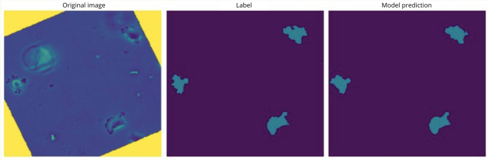

# CNN-based Segmentation of Cells in Multi-modal Microscopy Images

## Overview
Cell segmentation is one of the central tasks in biomedical image analysis. It enables counting the cell number, quantifying single-cell fluorescence intensity and tracking of cells to analyze their motion.

This project aims to develop a Convolutional Neural Network (CNN) for cell segmentation in microscopy images.

## Model and Data
The model we use is 2D U-Net model with zero-padding in the convolution layers. 
The datasets comprise 2D time-lapse microscopy image data from the Cell Tracking Challenge of three different imaging modalities:

* Fluorescence microscopy: HeLa cells stably expressing H2b-GFP
* Differential interference contrast (DIC) microscopy: HeLa cells on a flat glass
* Phase-contrast microscopy: Glioblastoma-astrocytoma U373 cells on a polyacrylamide substrate
